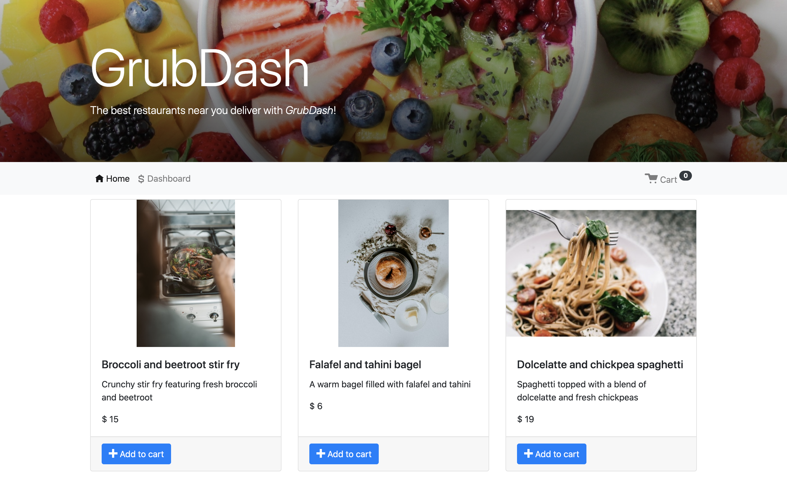
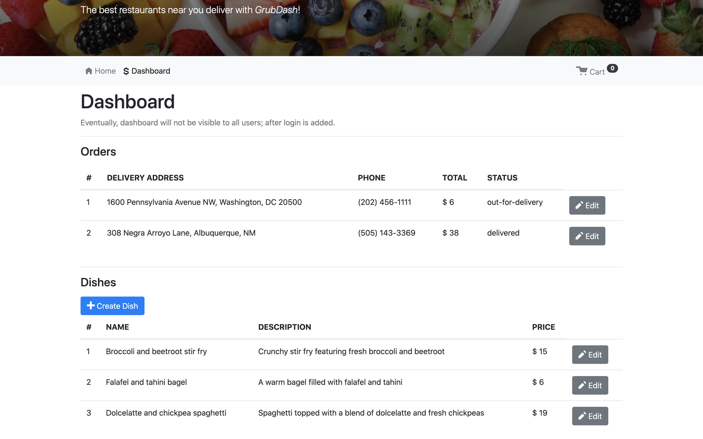
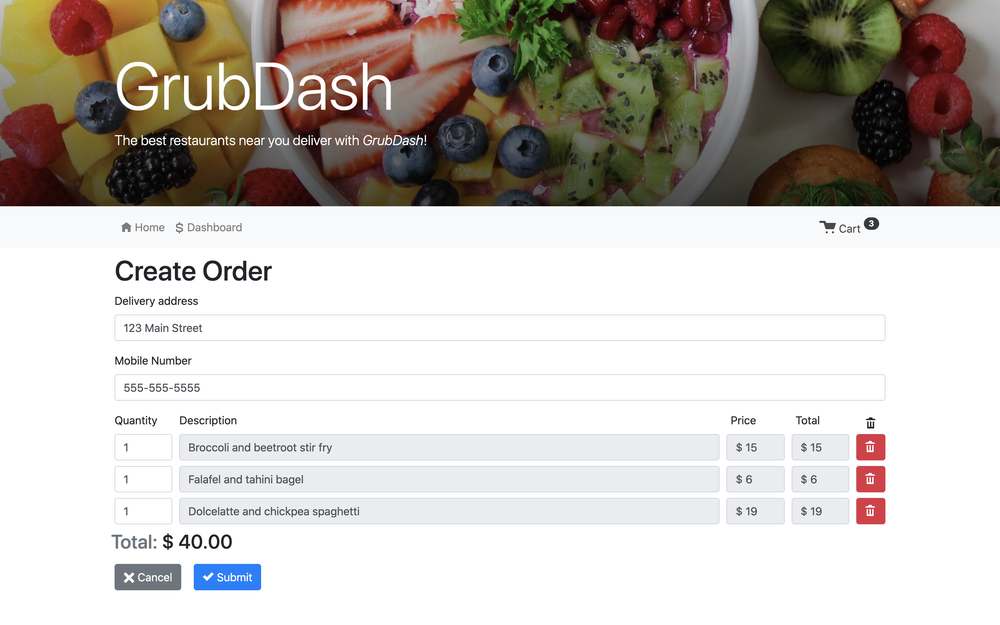
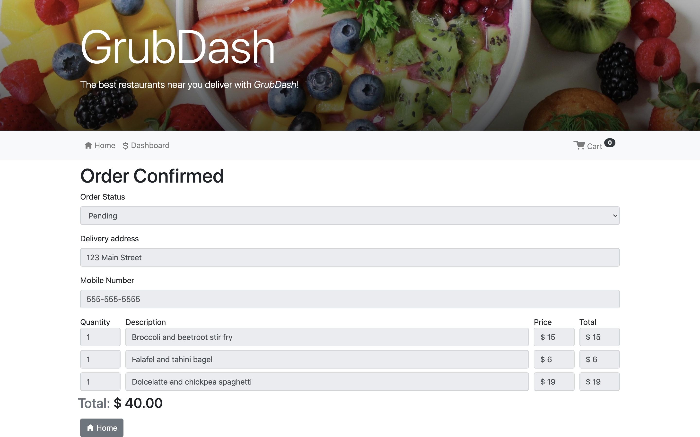
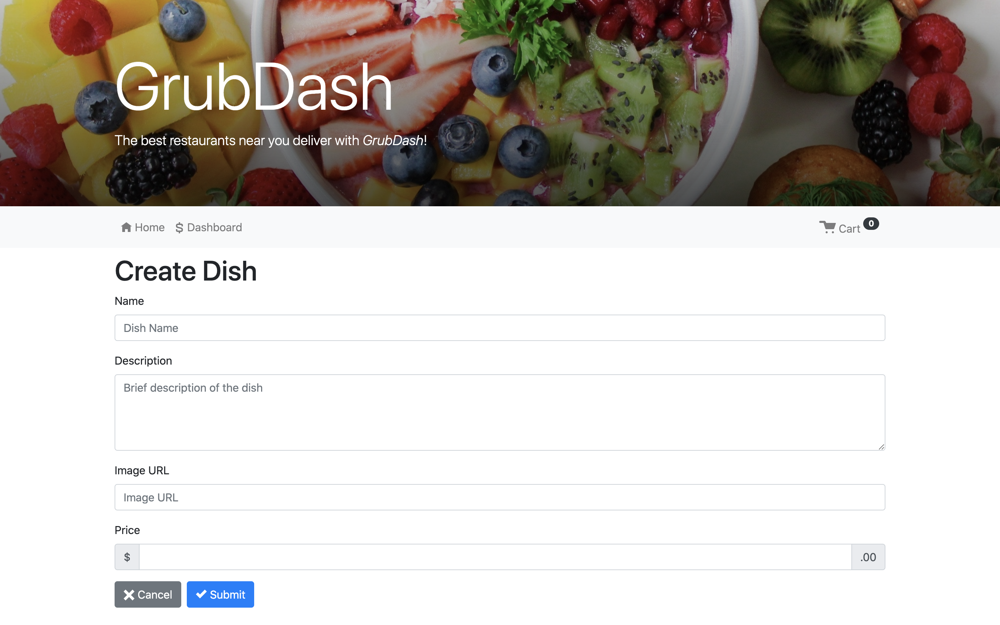

# GrubDash Restaurant Ordering System

> This project was created in the Thinkful Engineering Flex program. It demonstrates how to build a RESTful API to store data using Express.

> You've been hired as a backend developer for a new startup called GrubDash! As another developer works on the design and frontend experience, you have been tasked with setting up an API and building out specific routes so that the frontend developers can demo some initial design ideas for the big bosses.

## Learning Objectives

In this project, I built APIs with complex validation. The learning objectives of this project are:

- Running tests from the command line
- Using common middleware packages
- Receiving requests through routes
- Accessing relevant information through route parameters
- Building an API following RESTful design principles
- Writing custom middleware functions

## Built With

- Express
- Node.js

## Deployment

- [GrubDash](https://grub-dash-client-eight.vercel.app/)

| API path           |                                                                    |
| ------------------ | ------------------------------------------------------------------ |
| `/dishes`          | GET: List all dishes. POST: Create a dish.                         |
| `/dishes/:dishId`  | GET: Read a dish. PUT: Update a dish.                              |
| `/orders`          | GET: List all orders. POST: Create an order.                       |
| `/orders/:orderId` | GET: Read an order. PUT: Update an order. DELETE: Delete an order. |

##Screenshots

